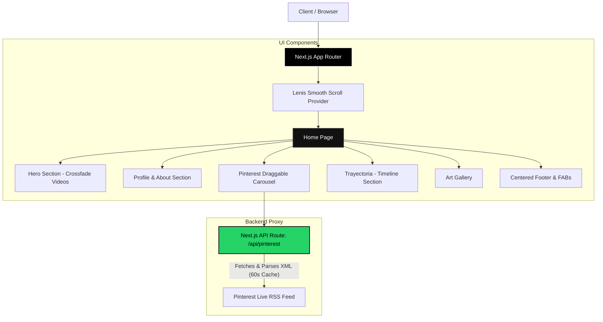

# Ezequiel Torres - Visual Artist Portfolio

Welcome to the official web portfolio of **Ezequiel Torres**, a Visual Artist from the province of Jujuy, Argentina. This project is designed as an ultra-modern, interactive, and highly aesthetic landing page following an "Editorial Fluid" design language.

## 🌟 Key Features

- **Immersive Video Hero**: A full-screen crossfading background video slider with a dark cinematic overlay to ensure perfect text readability.
- **Live Pinterest Integration**: A custom-built Server API route that silently fetches Ezequiel's live Pinterest RSS feed, extracting high-resolution images and displaying them in a native, draggable Framer Motion carousel (completely bypassing standard, clunky widget iframes).
- **Smooth Scrolling Experience**: Integrated with **Lenis** to provide a buttery-smooth scrolling experience across all devices.
- **Scroll-Triggered Animations**: Elements smoothly fade and slide into view as the user scrolls, powered by **Framer Motion**.
- **Interactive Action Buttons**: Features a floating WhatsApp action button with custom "breathing" and "ripple" animations to encourage user contact without being intrusive.
- **Minimalist & Centered Layouts**: A beautifully structured footer and gallery section designed to put the artist's work front and center.

## 🛠️ Technologies Used

This project leverages a modern React ecosystem to guarantee maximum performance and developer experience:

- **Framework**: [Next.js 14](https://nextjs.org/) (App Router)
- **Language**: [TypeScript](https://www.typescriptlang.org/)
- **Styling**: [Tailwind CSS](https://tailwindcss.com/)
- **Animations**: [Framer Motion](https://www.framer.com/motion/)
- **Smooth Scroll**: [Lenis](https://lenis.studiofreight.com/)
- **Icons**: [React Icons](https://react-icons.github.io/react-icons/) (Lucide & FA6)

## 🏗️ Architecture Overview

The application follows a clean Client/Server architecture using Next.js App Router capabilities. Notably, the Pinterest integration uses a backend proxy to prevent CORS issues and manage caching.



## 🚀 How to Run Locally

Follow these steps to run the project on your local machine:

1. **Clone the repository**:
   ```bash
   git clone https://github.com/MNATorres/ezequiel_torres_art.git
   cd ezequiel_torres_art
   ```

2. **Install dependencies**:
   ```bash
   npm install
   ```

3. **Start the development server**:
   ```bash
   npm run dev
   ```

4. **View the application**:
   Open your browser and navigate to [http://localhost:3000](http://localhost:3000).

---

*Designed and engineered with passion for visual arts.*
